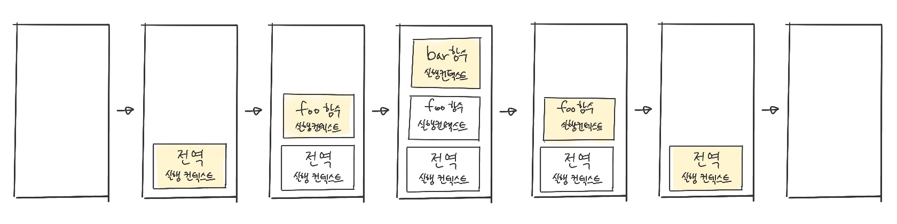

# Execution Context(실행 컨텍스트)
실행 컨텍스트는 식별자를 등록하고 관리하는 스코프와 코드 실행 순서 관리를 구현한 내부 메커니즘으로,
모든 코드는 실행 컨텍스트를 통해 실행되고 관리된다.

`식별자와 스코프`는 실행 컨텍스트의 **렉시컬 환경**으로 관리하고,  
`코드 실행 순서`는 **실행 컨텍스트 스택**으로 관리한다.

## 실행 컨텍스트 스택

```jsx
const x = 1;

function foo() {
	const y = 2;

	function bar() {
		const z = 3;
		console.log(x + y + z);	
	}
	bar();
}
foo(); // 6
```

위 코드를 실행하면 코드가 실행되는 시간의 흐름에 따라 실행 컨텍스트 스택에는 다음과 같이 실행컨텍스트가 추가(push)되고 제거(pop)된다.



1. `전역 코드의 평가와 실행`   
자바스크립트 엔진은 먼저 전역 코드를 평가해 전역 실행 컨텍스트를 생성하고 실행  컨텍스트에 푸시한다.
이때 전역변수 x와 전역함수 foo는 전역 실행 컨텍스트에 등록된다.
이후 전역 코드가 실행되기 시작하여 전역 변수 x에 값이 할당되고 전역 함수 foo가 호출된다
2. `foo 함수 코드의 평가와 실행`  
전역함수 foo가 호출되면 전역 코드의 실행은 일시 중단되고, 코드의 제어권이 foo 함수 내부로 이동.
foo 함수 내부의 함수 코드를 평가 → foo 함수 실행 컨텍스트 생성 → 실행 컨텍스트에 푸시(이때 foo 함수의 지역 변수 y와 중첩 함수 bar가 foo 함수 실행 컨텍스트에 등록) → foo 함수코드 실행되기 시작하여 지역변수 y에 값 할당, 중첩 함수 bar 호출
3. `bar 함수 코드의 평가와 실행`  
중첩 함수 bar가 호출되면 foo 함수 코드 실행은일시 중단되고 코드의 제어권이 bar 함수 내부로 이동.
bar 함수 내부의 함수 코드를 평가 → bar 함수 실행 컨텍스트 생성 → 실행 컨텍스트에 푸시(이때 bar 함수의 지역 변수 z가 bar 함수 실행 컨텍스트에 등록) → bar 함수코드 실행되기 시작하여 지역변수 z에 값 할당되고, console.log 메서드 호출 → bar 함수 종료
4. `foo 함수 코드로 복귀`   
bar 함수가 종료되면 코드 제어권은 다시 foo 함수로 이동(이때 자바스크립트 엔진은 bar 함수 실행 컨텍스트를 실행 컨텍스트 스택에서 팝하여 제거). 그리고 foo 함수는 더 이상 실행할 코드가 없으므로 종료된다.
5. `전역 코드로 복귀`  
foo 함수가 종료되면 코드의 제어권은 다시 전역 코드로 이동(이때 자바스크립트 엔진은 foo 함수 실행 컨텍스트를 실행 컨텍스트 스택에서 제거). 그리고 더 이상 실행할 전역 코드가 남아있지 않으므로 전역 실행 컨텍스트도 제거되어 실생 컨텍스트 스택에는 아무것도 남아있지 않게 된다.

## 렉시컬 환경
렉시컬 환경은 키와 값을 갖는 객체 형태의 스코프를 생성하여 식별자를 키로 등록하고 식별자에 바인딩된 값을 관리한다.

### 렉시컬 환경의 컴포넌트
1. `Environment Record(환경 레코드)`  
스코프에 포함된 식별자를 등록하고 식별자에 바인딩된 값을 관리하는 저장소.
2. `Outer Lexical Environment Reference(외부 렉시컬 환경에 대한 참조)`  
외부 렉시컬 환경에 대한 참조는 상위 스코프를 가리킨다.


## 참고 사이트
https://medium.com/crocusenergy/js-%EC%8B%A4%ED%96%89-%EC%BB%A8%ED%85%8D%EC%8A%A4%ED%8A%B8-2b8ab8da4f4