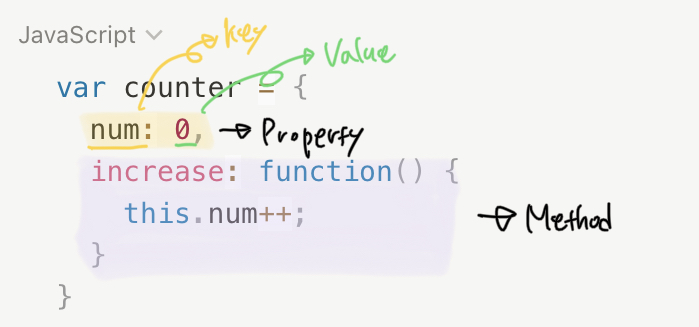

# 객체
- 다양한 타입의 값(원시 값 또는 다른 객체)을 하나의 단위로 구성한 복합적인 자료구조
- 객체는 변경 가능한 값(mutable data)이다.
- 0개 이상의 프로퍼티로 구성된 집합이며, 프로퍼티는 키(key)와 값(value)으로 구성된다.
- 자바스크립트에서 사용할 수 있는 모든 값은 프로퍼티 값이 될 수 있다.
프로퍼티의 값이 함수일 경우 일반 함수와 구분하기 위해 메서드(method)라 부른다.

`프로퍼티: 객체의 상태를 나타내는 값(data)`  
`메서드: 프로퍼티(상태 데이터)를 참조하고 조작할 수 있는 동작(behavior)`

## 빌트인 객체
### 표준 빌트인 객체
- ECMAScript 사양에 정의된 객체 (Object, String, Number, Boolean, Symbol, Date, Math, RegExp, Array, Map/Set, Function, Reflect, Proxy, JSON, Error 등)  
<a href="https://developer.mozilla.org/ko/docs/Web/JavaScript/Reference/Global_Objects" target="_blank">MDN 표준 내장 객체</a>

- 애플리케이션 전역의 공통 기능을 제공
- 실행환경과 관계 없이 언제나 사용 가능
- 전역 객체의 프로퍼티로서 제공. 따라서 별도의 선언 없이 참조 가능

### 호스트 객체
- 자바스크립트 실행환경(브라우저 환경 또는 Node.js 환경)에서 추가로 제공하는 객체
- 브라우저 환경: DOM, BOM, Canvas, XMLHttpRequest, fetch, requestAnimationFrame, SVG, Web Storage, Web Component, Web Worker와 같은 클라이언트 사이드 Web API 호스트 객체로 제공
- Node.js 환경: Node.js 고유의 API를 호스트 객체로 제공

### 사용자 정의 객체
- 사용자가 직접 정의한 객체